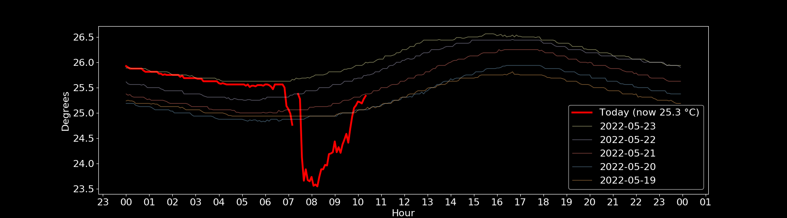

# This is a testing repo

- [x] Create text files
- [x]	Create a branch
- [x]	Create files on a branch different from main
- [ ]	Move a file from one branch to another
- [ ]	Merge a branch to the main

Do whatever you want

### Images

PNG

SVG

